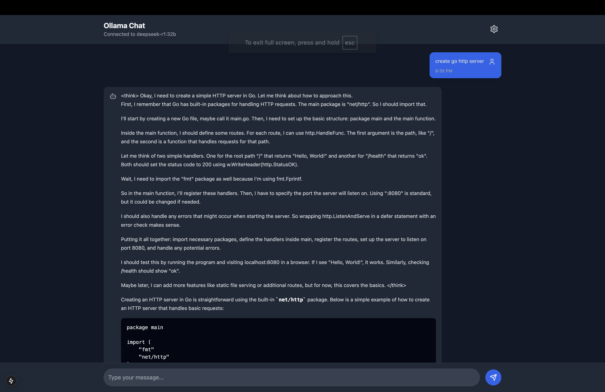
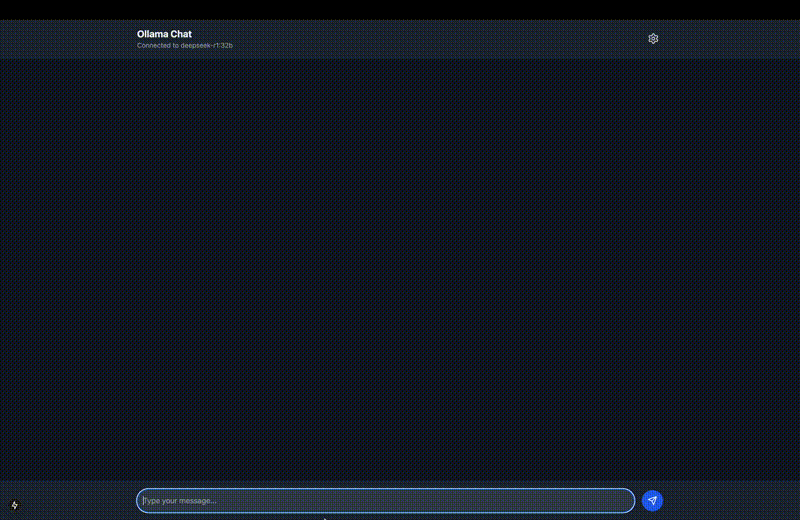

# Ollama Chat Interface

A modern, responsive chat interface for Ollama AI models, built with Next.js.



## Features

- 🚀 Clean, intuitive chat interface
- 🔄 Real-time model responses
- ⚙️ Configurable model selection
- 🔌 Custom endpoint configuration
- 📱 Mobile-responsive design

## Prerequisites

- Node.js 16+
- Ollama installed and running locally
- An AI model pulled through Ollama (e.g., deepseek-r1:32b)

## Quick Start

1. Clone the repository:
```bash
git clone https://github.com/hmbenhaim/ollama-chat
```

2. Install dependencies:
```bash
cd ollama-chat
npm install
```

3. Start the development server:
```bash
npm run dev
```

4. Open [http://localhost:3000](http://localhost:3000) in your browser

## Demo 



## Configuration

The chat interface connects to Ollama on port 11434 by default. You can modify the endpoint through the settings menu in the UI.

## Default Model

The application is configured to use the DeepSeek-R1 model by default. You can change this through the settings menu or modify the default in the configuration.

## Contributing

Contributions are welcome! Please feel free to submit a Pull Request.

## License

MIT License with Attribution

Copyright (c) 2024 Henry (Haim) Ben Haim

Permission is hereby granted, free of charge, to any person obtaining a copy of this software and associated documentation files (the "Software"), to deal in the Software, including without limitation the rights to use, copy, modify, merge, publish, distribute, sublicense, and/or sell copies of the Software, and to permit persons to whom the Software is furnished to do so, subject to the following conditions:

1. The above copyright notice and this permission notice shall be included in all copies or substantial portions of the Software.

2. Any use of this Software must include visible attribution to the original author (Hatem Ben Haim) and a link to the original repository (https://github.com/hmbenhaim/ollama-chat).

3. DISCLAIMER OF LIABILITY:
   THE SOFTWARE IS PROVIDED "AS IS", WITHOUT WARRANTY OF ANY KIND, EXPRESS OR IMPLIED, INCLUDING BUT NOT LIMITED TO THE WARRANTIES OF MERCHANTABILITY, FITNESS FOR A PARTICULAR PURPOSE AND NONINFRINGEMENT. IN NO EVENT SHALL THE AUTHORS OR COPYRIGHT HOLDERS BE LIABLE FOR ANY CLAIM, DAMAGES OR OTHER LIABILITY, WHETHER IN AN ACTION OF CONTRACT, TORT OR OTHERWISE, ARISING FROM, OUT OF OR IN CONNECTION WITH THE SOFTWARE OR THE USE OR OTHER DEALINGS IN THE SOFTWARE.

By using this software, you agree to these terms.

## Support

If you find this project helpful, please give it a ⭐️